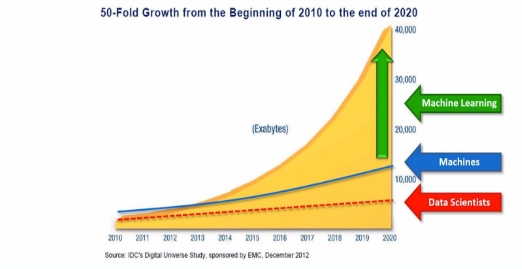
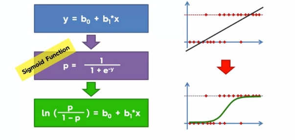
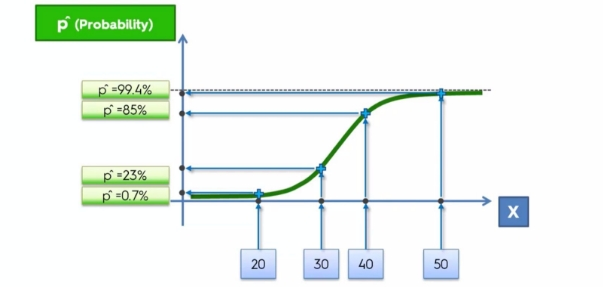
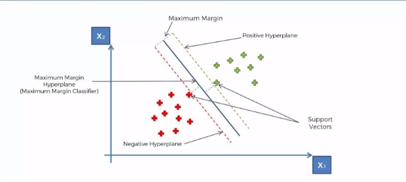
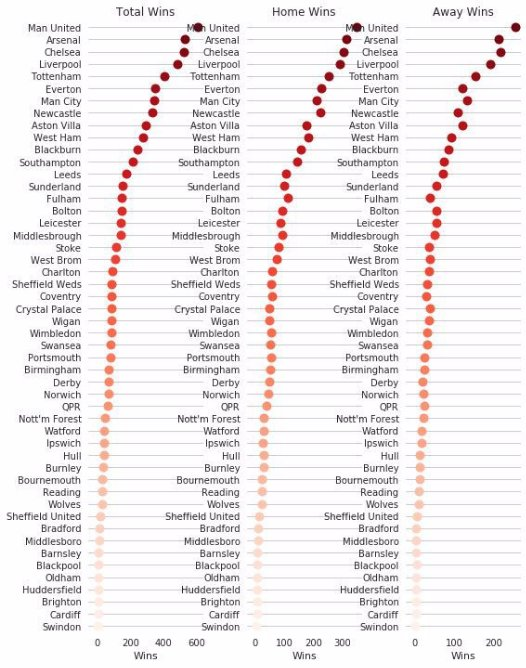

**EPL: Data Analysis and Prediction using Machine Learning** 

A report submitted to Cluster Innovation Centre in the fulfillment of the requirements of the paper: 

***III.7 Summer Internship: Projects drawn from the world around us* Internship period:- 1st June - 1st August** 

**Presented by:** 

Nishant Joywardhan (11824) Satyam Sinha (11834) 

**Under the Supervision of: Prof. Shobha Bagai** 

Cluster Innovation Centre University of Delhi      Delhi-110007 

**Certificate of Originality **

The  work  embodied  in  this  report  entitled  “EPL:  Data  Analysis  and  Predictions  using Machine Learning” has been carried out by *Nishant Joywardhan (11824)*, and *Satyam Sinha (11834)*, for the paper **“*III.7 Summer Internship: Projects drawn from the world around us*”.**  This  internship  has  been  carried  out  under  the  supervision of *Prof. Shobha Bagai*, Cluster  Innovation  Centre,  University  of  Delhi.  We  declare  that  the work and language included in this project report is free from any kind of plagiarism.

**Nishant Joywardhan Satyam Sinha**

**Acknowledgement **

With a deep sense of gratitude, we express our dearest indebtedness to our mentor, Prof. Shobha Bagai, for her support throughout the duration of this project. Her learned advice and constant encouragement have helped us significantly improve the quality of our final report, besides the project itself.  

We  are  also  thankful  to  our  college, Cluster Innovation Centre (CIC), for providing the facilities and the necessary resources to complete our work.

**Abstract **

**EPL: Data Analysis and Predictions using Machine** 

**Learning**

**by** 

**Nishant Joywardhan Satyam Sinha** 

***Cluster Innovation Centre, 2019*** 

Machine Learning is basically an application of Artificial Intelligence (AI) that provides a computer system, the ability to automatically learn and improve from its experience, without any human intervention or explicit coding. Machine Learning is being used these days in many walks of our daily life such as: Facebook face recognition, Motion Sensing in Video Games, VR headsets, Text to speech and vice versa, Space Technology, Recommendations on Amazon, etc. 

This  particular  project is intended towards connecting Machine Learning with a real life sport, which is played by almost 250 million players in over 200 countries, namely Football. 

We first use our knowledge in doing an extensive analysis of a dataset of English Premier League which is then followed by an attempt to make a prediction of the football matches of EPL  on  another  small,  but  extensive  dataset.  This  is  done  by  applying  some  famous algorithms of machine learning to the dataset, such as the Logistic Regression and Support Vector Machine (SVM). Finally we see our limitations and the scope of improvement. 

**Index**

1. [Certificate of Originality](#_page1_x72.06_y72.06) [1](#_page1_x72.06_y72.06) 
1. [Acknowledgement](#_page2_x72.06_y72.06) [2](#_page2_x72.06_y72.06) 
1. [Abstract](#_page3_x72.06_y72.06) [3](#_page3_x72.06_y72.06) 
1. [Chapter 1](#_page5_x72.06_y72.06) 5 
1. [Introduction to Machine Learning](#_page5_x72.06_y163.64) 5 
1. [Data Preprocessing](#_page6_x72.06_y72.06) 6 
1. [Other steps involved in Data Preprocessing](#_page7_x72.06_y72.06) 7 
1. [Logistic Regression ](#_page7_x72.06_y602.00) 8 
1. Support Vector Machine (SVM) 10 
5. [Chapter - 2](#_page12_x72.06_y72.06) [1](#_page12_x72.06_y72.06)2 
   1. [Analysis of  EPL dataset](#_page12_x72.06_y136.61) [1](#_page12_x72.06_y136.61)2 
5. [Chapter - 3](#_page19_x72.06_y72.06) 19 
   1. [Attempt to make match predictions](#_page19_x72.06_y136.61) 19 
   1. [Real life application](#_page20_x72.06_y72.06) [2](#_page20_x72.06_y72.06)0 
5. Conclusion 21 
5. [REFERENCES](#_page22_x72.06_y72.06) [2](#_page22_x72.06_y72.06)2 
5. [Appendix](#_page23_x72.06_y72.06) [2](#_page23_x72.06_y72.06)3 

**Chapter 1**

**Introduction to Machine Learning** 

In this modern world, we are surrounded by ‘Data’. It is literally everywhere around us and we as humans, constantly undergo “Data Exhaust”, which is the generation of Data as a byproduct of the online actions and choices of the users. The byproducts contain various files generated by web browsers and their plug-ins such as cookies, log files, flash cookies, etc.  All this is leading to an exponential growth of data.  

Upto  2005,  we  had  around  130  exabytes  of  data which is expected to rise upto 40,000 exabytes of data by the year 2020. This is a massive growth, and this enormous amount of data  becomes  very  difficult  to  be  handled  by  human  beings.  Thus  comes  the  need  of machines and precisely, Machine Learning. This fact can be demonstrated by the following diagram:-  

**Data Preprocessing** 

Before applying any Machine Learning algorithm to a dataset, we need to prepare the dataset. This process is called Data Preprocessing, and it  is the prerequisite of applying machine learning models. 

One of the most basic steps is to import the libraries and the dependencies that we will need for our code to successfully execute.  

A library is basically a tool that helps a job get done by returning the desired output. In machine learning, we use three most common python libraries:-  

- **Numpy (np) -** NumPy is a general-purpose array-processing package. It provides a high-performance multidimensional array object, and tools for working with these 

arrays. It basically contains mathematical tools. **- Matplotlib.pyplot (plt) -**Matplotlib is an amazing visualization library in Python for 

2D plots of arrays. Matplotlib is a multi-platform data visualization library built on NumPy arrays and designed to work with the broader SciPy stack. It is**  used to plot charts and graphs with its intuitive tools. 

- **Pandas (pd) -** it is the most popular python library that is used for data analysis. It 

provides highly optimized performance with back-end source code is purely written in *C* or Python. It is used to import datasets and manage them. 

Before importing any dataset, we set a working directory, which the folder that contains the dataset.  After  setting  the  working  directory,  we  get  all  set  for  importing  libraries  and carrying out our work.  

For  the  available  data,  we create a matrix of features and the dependent variable or the variable that needs to be predicted.One real life problem which we face is some missing data in our dataset and we need to find a solution for the ML models to run correctly on them. The simple solution is, we replace the missing data with the **mean** of all the available data. For achieving this, we use a very famous library of python, the **Sklearn** library and import the class **Imputer** from its sublibrary **preprocessing**.  

After completing all the above steps, the data is ready for further processing!

**Other steps involved in Data Preprocessing** 

- ***Dealing  with  Categorical  Data-***  In  our  dataset, we might have some data points which are texts and not numbers. However, to apply Machine Learning models to the data, it has to be converted into numbers. That is how the categorical data is dealt with. This step also involves a concept known as Dummy encoding, which is used when any text to number conversion makes no sense. 
- ***Splitting the dataset into Training set and Test set-  \***This is one very important step. The  concept  is,  we  apply  ML  model  to  our  training  set  and  it  understands  the correlation between the independent and the dependent variables. Now to check if the model can adapt to any new situation or not, we apply it on the test set and do the checking part.  
  - Training set→ The data on which the machine learns 
  - Test set→ The data on which we check if the machine learnt correct 
- ***Feature Scaling-***   One very basic requirement of ML is to have data on a common scale. This is because in many ML models, we apply the Euclidean distance to predict some results and we don't want that distance to be dominated by just one entry of input data, because of it being in a different scale.Thus, the process of feature scaling is applied and we obtain all the dataset in a common scale.  

After completing all the above mentioned steps, we have our data preprocessed and ready to be used further in our code! 

**Logistic Regression**  

Logistic Regression is basically a classification technique that is used to predict a category, unlike the normal regression methods where we predict a continuous number or variable.  Logistic Regression is applied by taking a linear regression model and then modifying it according to our needs.  

This modification can be demonstrated by the following pictorial representation:-  

We see that with the application of the sigmoid function, we change the linear regression model to our logistic regression model and similarly, the straight line best fit changes to a curved best fit and suits the type of data distribution for which it is deployed.  

The final formula obtained is termed as the Logistic Regression Formula, and it can be further used for predicting the probabilities in different situations, as per the need.  

This can be demonstrated in the following pictorial representation:-  

In simple terms, this model helps us to find a correlation between the X and Y variables which was not possible earlier. Once the probabilities are determined, we can use it further for other determinations and result analysis.  

**Support Vector Machine (SVM)**  

Support  Vector  Machines  try  to  find  a  classifier  which  maximizes  the  margin  between positive  and  negative  data  points.  This  technique  basically  can  be  demonstrated  by  the following pictorial representation:  

In case we have two categories of data and we need to draw a decision boundary line to determine into which category should we place a new data point, that’s where we make use of the Support Vector Machines. 

The line marked as the ‘Maximum Margin’ is equidistant from the two support vectors. The length of the margin has to basically be maximum for the line to be the justified result of Support Vector Machine. 

The support vectors are the data points that are supporting the whole algorithm. Once the points  through  which  support  vectors  pass  are  identified,  then  the  other  points  can  be removed as well and still the algorithm will behave the same as they don’t contribute to the result.  

The decision boundary line is termed as the Maximum Margin Hyperplane or Maximum Margin Classifier. 

Support Vector Machines generally do the classification on the basis of the EXTREME or the BOUNDARY case and uses it to provide its results. This in itself is a very unique thing. These boundary case data points are the support vectors, used for further classification.  

This new approach makes SVM really effective and special.  

**Support  Vector  Regression  (SVR)** is a type of SVM that can support both Linear and Non-Linear Regression. In higher dimensional space, SVR performs Linear Regression.  

It can be represented by the following diagram:-  

**Chapter - 2  **

**Analysis of  EPL dataset** 

The dataset that we have picked out for this analysis is basically a confined data which has columns like Home team, the away team, the half time results for both teams, the season to which the match belongs, and finally the FTR or the full time result.  

The major aim of this analysis is to visualize all the above-mentioned data points in a better manner with the help of graphs, pie charts, dot plot, and a heat map.  

The first step involves recording who won the game, the home team, the away team or was it a draw between them. This result is visualized in the form of a pie chart:-  

We can clearly see that the home team has a massive 46.2% chance of winning the game. We can reason this in the following manner:-  

- Football is a team sport. A cheering crowd helps the morale of the players. That’s why we have many times seen a less powerful home team defeat a stronger away team. 
- Familiarity with the pitch and the weather conditions helps. Just like any other sport, the  physical  conditions  matter a lot in football and a good understanding of it is always beneficial. 
- No travel involved, which implies no fatigue. The away team needs to travel to the home team’s city and the stadium and however small the trip might be, it always causes some fatigue which is reflected in the performance of the players on the pitch. 

After this, we analyze various different stats of the dataset, and try to visualize each of them with the help of graphs.  

- Total goals per season over time:-  

We can see that the total number of goals per season has gone down due in part with the fact that the number of games per season has decreased since the earlier stages of the game. For eg- initially there used to be 45+ matches in the entire league, but now its just limited to 36. 

- Number of goals per game per season:-  

We see that the average goal per season per game is generally between 2 and 3, which is fair enough as each game generally does see at least 2-3 goals being scored in totality.  

- Number of goals scored on a day of the month, per season :-  

The above graph is again justified as Saturday is the day of the week on which the maximum number of matches are played and hence, the maximum number of goals are scored. 

- After visualizing these basic stats, we look at the home and away wins per team and we chart them. This gives us an idea as to how each team has performed on a common scale.  
- We then come to one of the major parts of this analysis, where we plot the heat map of teams for their win over time. Also, the heat map generated is very accurate, as we can see, some very rare discrete points on it which represent the rare victories of teams in any particular season.  

For eg- Leicester City miraculously won the English Premier League in the 2015-16 season, and this is very well shown on the heat map by a rare green spot.  

Similarly, other such incidents has also been taken care of, to make the heat map, an accurate plot. 

- The final step in this analysis is to make a dot plot of wins of teams in home and away conditions. The result obtained is:-  

The above dot plot is again an accurate one, showing the overall standings of the teams with respect to their victories in home and away games. It tells us a lot about the teams and in itself, can be used to make future analysis and predictions.  

One  fun  fact  which  can  be  mentioned  at  this  point  is, the previous results and fixtures between two teams is always a determining criteria for what the outcome of future matches is going to be. For example, a match between Chelsea and FC Barcelona in the knockout round of  the  UEFA  Champions League of 2008-09 edition saw Chelsea being knocked out by Barcelona by a 90th min stunner by the club legend Andres Iniesta. That season saw FC Barcelona go on to win the prestigious trophy for the third time in their career. 

3  years  later,  the  two  teams  met  again  in the knockout round of the same competition. However, no one had forgotten the last meeting between the two clubs. The emotions of the fans and the cheering crowd was really high throughout the two legs and it ultimately saw Chelsea have their hands on revenge, by knocking Barcelona out of the competition and ultimately go on to win that year’s UCL trophy.  

This above example makes us realize the importance of analyzing the previous match data between the teams to reach an optimum level of future match predictions involving the same teams. 

**Chapter - 3  **

**Attempt to make match predictions** 

This section saw us making an attempt to make predictions on another ‘extensive’ dataset of the English Premier League. To make this possible, we took help of two famous algorithms of Machine Learning, namely Logistic Regression and Support Vector Machine (SVM).  

This process is done in four simple steps:- 

- Cleaning the dataset, which implies taking only those features from the dataset, which will  actually  impact  the  outcomes  of  the  matches  and  which  are  predictable  in 

themselves, such as who is going to start the game, the lineup, the weather condition that day, etc.  - Splitting the dataset into training and test set with almost 12 features in the feature matrix  and  one  dependent  variable  to  be  predicted,  namely  the  FTR  (Full  Time Result). - Training the two different classifiers on the dataset, namely LR and SVM. - Using the better classifier to predict who is going to win the game, given a home and an away team.  

So we again follow the steps. We prepare our dataset and we split it into training and test set. Then  after going through all the other steps of applying a machine learning algorithm, we see that both SVM and LR give nearly equal and good prediction with an accuracy of about 72% in both the cases. 

Hence in this manner, we can use our ML models to predict many results by taking a detailed and extensive dataset.  

However, this result still has a lot of scope of improvement and can give much better results.  

**Real life application** 

Presently, sports betting is a market of around 500 billion dollars and this market is ever increasing. Many different techniques are used to accomplish the task of predicting which team is going to win a match. There is a whole industry around it. There are pre match analysis,  in  game  analysis  by  commentators,  and  there  are  entire  channels  like  ESPN dedicated for this work. The below graph shows the ever increasing numbers in the sports market:-  

In 2014, Bing owned by Microsoft made predictions of the knockout stages of the FIFA World Cup with an accuracy of 100%, that is it could correctly predict the outcome of every single knockout game of the tournament. This is a massive achievement by any prediction model and it would have led to huge turnovers in the sports market.  

Thus, we can apply machine learning to this happening market around us, and maybe make some money out of it!  

**Conclusion **

The objectives of this project have been well achieved by our earnest efforts.  

To tackle the problem efficiently and in a professional manner, first, we brushed up our skills with respect to Python, Machine Learning and different platforms like Spyder and Jupyter Notebook. 

After extensive working and some sincere inputs, our achievements through this project have been at par with the objectives. However, just like everything has a scope of improvement, so is the case with our project.  

The data points used by us in making the prediction is limited and thus leading to not enough accuracy  in  our  model.  This  can  be  improved  by  adding some more data points before making the prediction such as, Sentiments from Twitter (hashtags trending on twitter and what people are talking about teams as a whole can provide us with some really effective data points),  more features from other data sources such as how much others have bet and on which  team,  or  player  specific health and fitness stats, etc. Addition of these mentioned features can very well help us in enhancing our accuracy of predictions.  

We would surely like to extend this project further and incorporate these missing features and technicalities. 

As already mentioned, sports betting is a HUGE market, and if we can target it with the concepts of a tool as powerful as Machine Learning, then we can surely make significant progress in it, and the complexity of the situations and hence the dataset, can help us learn and grow a lot as individuals on a personal level and as a CSE student on a professional level. 

**REFERENCES **

1. “Machine Learning A-Z (Python & R in Data Science Course).” *Udemy*, [www.udemy.com/machinelearning/](http://www.udemy.com/machinelearning/). 
1. Snoek, Jasper, et al. “Practical Bayesian Optimization of Machine Learning Algorithms.” *Practical Bayesian Optimization of Machine Learning Algorithms*, 1 Jan. 1970, papers.nips.cc/paper/4522-practical-bayesian-optimization. 
1. Snoek, Jasper, et al. “Practical Bayesian Optimization of Machine Learning Algorithms.” *Practical Bayesian Optimization of Machine Learning Algorithms*, 1 Jan. 1970, papers.nips.cc/paper/4522-practical-bayesian-optimization. 
1. llSourcell. “LlSourcell/Predicting\_Winning\_Teams.” *GitHub*, 23 Aug. 2017, github.com/llSourcell/Predicting\_Winning\_Teams. 
1. Drakos, Georgios. “Support Vector Machine vs Logistic Regression.” *Medium*, Towards Data Science, 5 Oct. 2018, towardsdatascience.com/support-vector-machine-vs-logistic-regression-94cc2975433f. 

**Appendix **

Snippets of data analysis code: #1 

**import pandas as pd **

**import numpy as np** 

**import matplotlib.pyplot as plt import seaborn as sns** 

**df=pd.read\_csv("EPL\_set.csv") len(df)** 

**df.head(5)** 

#2 

**df['result'] = 'draw' **

**df.loc[df['FTHG'] > df['FTAG'], 'result'] = 'home' df.loc[df['FTAG'] > df['FTHG'], 'result'] = 'visitor' df.groupby('result')['result'].count()** 

#3 

**df.groupby('result')['result'].count().plot(kind='pie', autopct='%1.1f%%', figsize=(4,4))** 

#4 

**df.groupby('result')['result'].count().plot(kind='pie', autopct='%1.1f%%', figsize=(4,4))** 

#5 

**df.groupby('result')['result'].count().plot(kind='pie', autopct='%1.1f%%', figsize=(4,4))** 

#6 

- **show average goals per game per season **

**ab = df.groupby('Season')['total\_goals'].mean().plot(kind="bar", title="Avg. Goals Per Game Per Season", figsize=(12, 8)) ab.set\_xlabel("Season")** 

**ab.set\_ylabel("Average Goals")** 

#7 

- **determine number of games per month and day **

**df['game\_date'] = pd.to\_datetime(df['Date'])** 

**df['game\_month'] = df['game\_date'].dt.month** 

**df['game\_weekday'] = df['game\_date'].dt.weekday** 

- **by month df.groupby([df['game\_date'].dt.month])["Div"].count().plot(kind='b ar')** 

#8 

- **by week day - most games are on saturday df.groupby('game\_weekday')['Div'].count().plot(kind='bar')** 
- **where 0 = monday and so forth** 

#9 

- **Goals per month **

**sns.boxplot(x='game\_month', y='total\_goals', data=df)** 

#10 

- **Goals per gameday **

**sns.boxplot(x='game\_weekday', y='total\_goals', data=df)** 

#11 

- **Goals per gameday **

**sns.boxplot(x='game\_weekday', y='total\_goals', data=df)** 

- **How many home and visitor wins added as new columns** 

**df = df.merge(pd.get\_dummies(df['result']), left\_index=True, right\_index=True)** 

**df['home\_wins\_this\_season'] = df.groupby(['Season','HomeTeam'])['home'].transform('sum') df['visitor\_wins\_this\_season'] = df.groupby(['Season','AwayTeam'])['visitor'].transform('sum')** 

#12 

- **Which teams win the most home games on average  **

**(** 

`    `**df.groupby(['HomeTeam'])['home\_wins\_this\_season']     .agg(['count','mean'])** 

`    `**.sort\_values(ascending=False, by='mean')** 

`    `**.round(1)** 

`    `**.head(10)** 

**)** 

#13 

- **Which teams win the most away games on average **

**(** 

`    `**df.groupby(['AwayTeam'])['visitor\_wins\_this\_season']     .agg(['count','mean'])** 

`    `**.sort\_values(ascending=False, by='mean')** 

`    `**.round(1)** 

`    `**.head(10)** 

**)** 

#14 

- **tally up the results  **

**visitor\_results = (df** 

`                   `**.groupby(['Season', 'AwayTeam'])['visitor']                    .sum()** 

`                   `**.reset\_index()** 

`                   `**.rename(columns={'AwayTeam': 'team',** 

`                                    `**'visitor': 'visitor\_wins'}))** 

**home\_results = (df** 

`                 `**.groupby(['Season', 'HomeTeam'])['home']                  .sum() **

`                 `**.reset\_index()** 

`                 `**.rename(columns={'HomeTeam': 'team',** 

`                                  `**'home': 'home\_wins'}))** 

**wins\_per\_season = visitor\_results.merge(home\_results, on=['Season', 'team'])** 

**Wins\_per\_season['total\_wins'] = wins\_per\_season['visitor\_wins'] + wins\_per\_season['home\_wins']** 

**wins\_per\_season.head(5)** 

#15 

- **Make a heatmap of wins over time **

**total\_wins\_sorted\_desc = (wins\_per\_season** 

`                          `**.groupby(['team'])['total\_wins']                           .sum()** 

`                          `**.sort\_values(ascending=False)** 

`                          `**.reset\_index()['team'])** 

**wins\_per\_season\_pivot = (wins\_per\_season** 

`                         `**.pivot\_table(index='team',** 

`                                      `**columns='Season',** 

`                                      `**values='total\_wins')                          .fillna(0)** 

`                         `**.reindex(total\_wins\_sorted\_desc))** 

**plt.figure(figsize=(10, 20)) sns.heatmap(wins\_per\_season\_pivot, cmap='viridis')** 

#16 

- **showing dot plot of wins per team per home/away sns.set(style="whitegrid")** 

**wps = wins\_per\_season.groupby(['team'])['total\_wins','home\_wins','visito r\_wins'].sum().reset\_index()** 

**g = sns.PairGrid(wps.sort\_values("total\_wins", ascending=False),                  x\_vars=wps.columns[1:], y\_vars=["team"],** 

`                 `**size=10, aspect=.25) **

- **Draw a dot plot using the stripplot function g.map(sns.stripplot, size=10, orient="h",       palette="Reds\_r", edgecolor="gray")** 
- **Use the same x axis limits on all columns and add better labels g.set(xlabel="Wins", ylabel="")** 
- **Add titles for the columns** 

**titles = ["Total Wins", "Home Wins", "Away Wins"]** 

**for ax, title in zip(g.axes.flat, titles):** 

- **Set a different title for each axes** 

`    `**ax.set(title=title)** 

- **Make the grid horizontal instead of vertical** 

`    `**ax.xaxis.grid(False)** 

`    `**ax.yaxis.grid(True)** 

**sns.despine(left=True, bottom=True)** Snippet of the ML models implementation code:  

- **Initialize the two models **

**clf\_A = LogisticRegression(random\_state = 42)** 

**clf\_B = SVC(random\_state = 912, kernel='rbf')** 

**#Boosting refers to this general problem of producing a very accurate prediction rule**  

**#by combining rough and moderately inaccurate rules-of-thumb train\_predict(clf\_A, X\_train, y\_train, X\_test, y\_test) print ''** 

**train\_predict(clf\_B, X\_train, y\_train, X\_test, y\_test) print ''** 

**Output:**  

Training a LogisticRegression using a training set size of 5550. . . Trained model in 0.2450 seconds 

Made predictions in 0.0380 seconds. 

0\.621561035256 0.665405405405 

F1 score and accuracy score for training set: 0.6216 , 0.6654. 

Made predictions in 0.0000 seconds. 

F1 score and accuracy score for test set: 0.6957 , 0.7200. 

Training a SVC using a training set size of 5550. . . 

Trained model in 2.5040 seconds 

Made predictions in 1.2430 seconds. 

0\.620453572957 0.68036036036 

F1 score and accuracy score for training set: 0.6205 , 0.6804. Made predictions in 0.0250 seconds. 

F1 score and accuracy score for test set: 0.6818 , 0.7200. 
28 
